# 🏗️ DIAGRAMA DE ARQUITECTURA (VISUAL)

## CÓMO VER COMO IMAGEN:
1. Ve a: https://mermaid.live/
2. Copia el código del diagrama
3. Se genera automáticamente
4. Descarga como PNG o SVG

---

## ARQUITECTURA EN CAPAS DEL SISTEMA

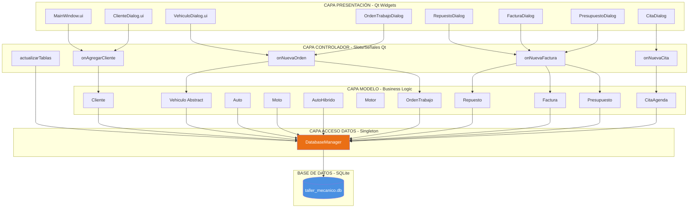

---

## FLUJO DE DATOS - CREAR FACTURA

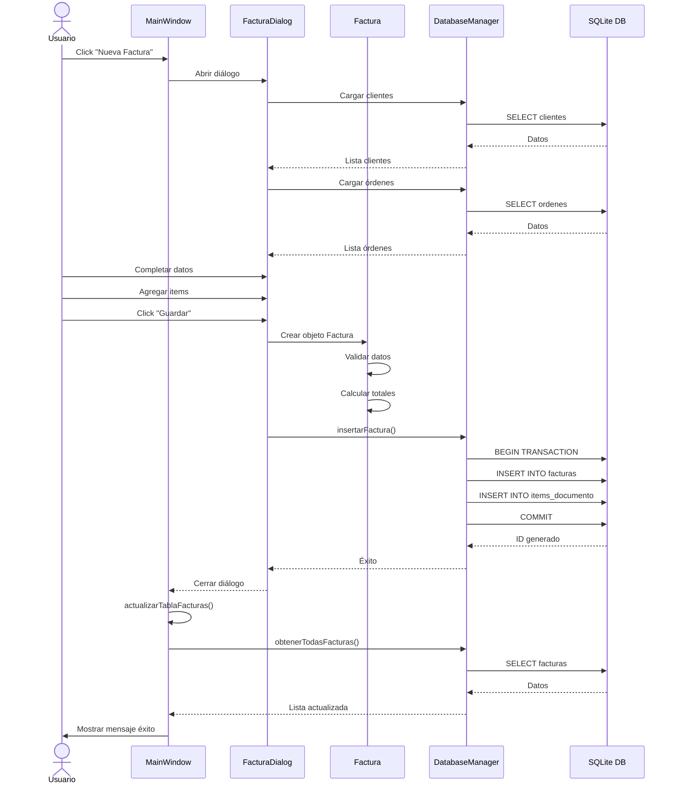

---

## FLUJO DE DATOS - REGISTRAR CLIENTE

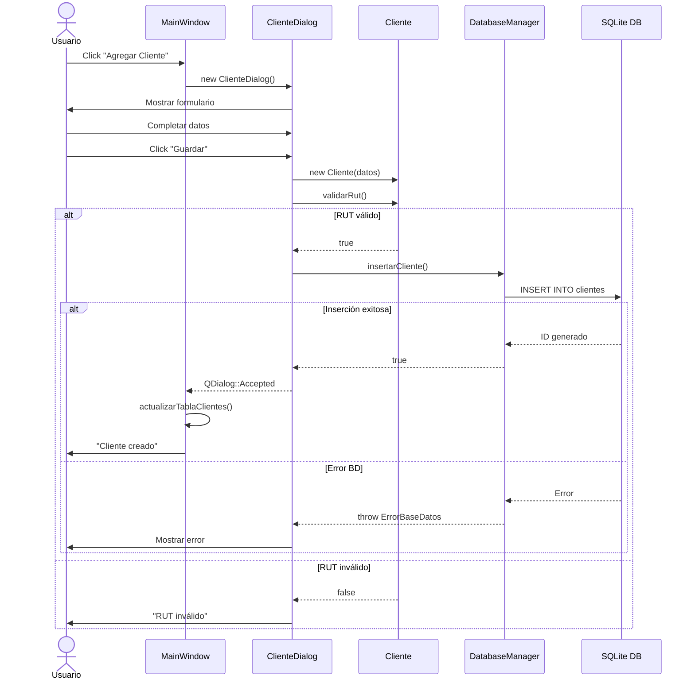

---

## PATRÓN MVC (Model-View-Controller)

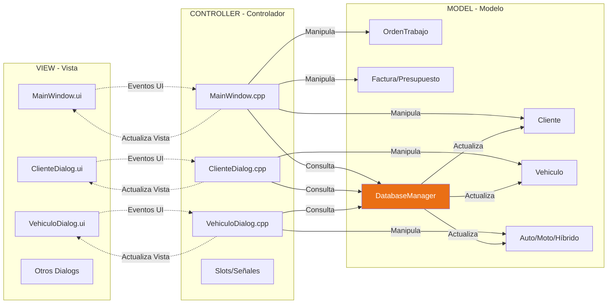

---

## PATRÓN SINGLETON - DatabaseManager

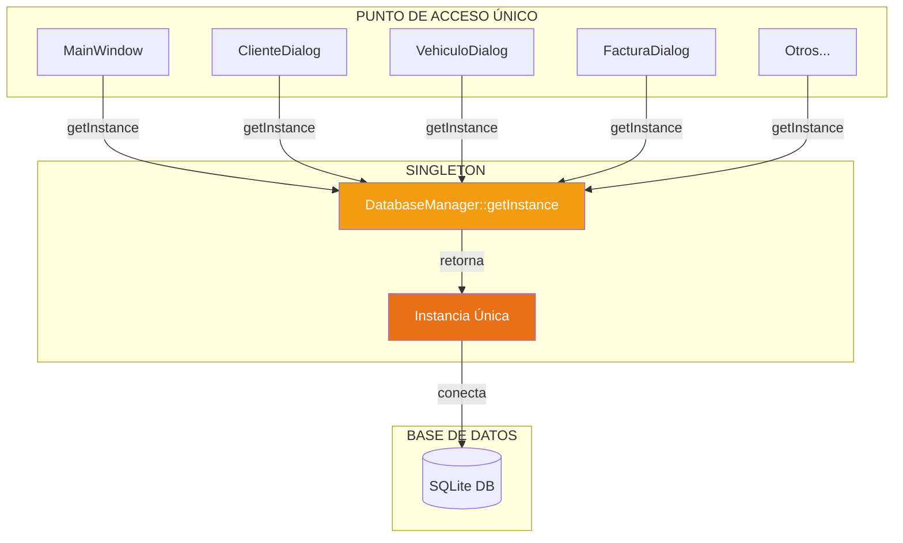

---

## JERARQUÍA DE HERENCIA

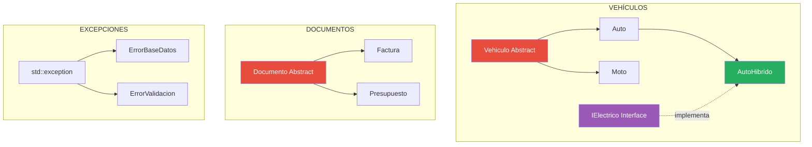

---

## COMPOSICIÓN Y AGREGACIÓN

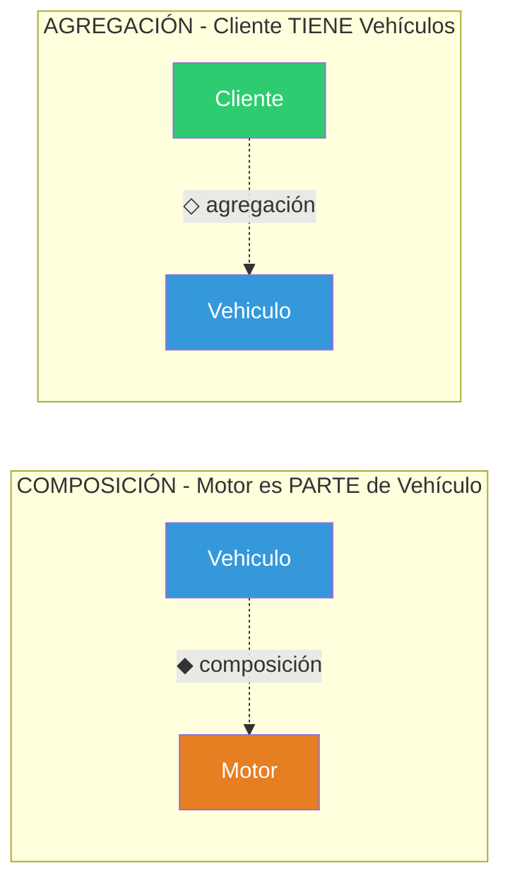

---

## MÓDULOS DEL SISTEMA

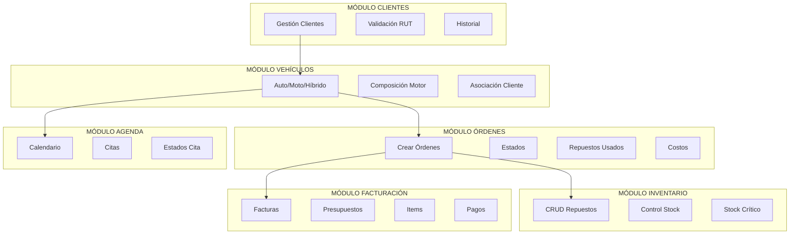

---

## ESTRUCTURA DE ARCHIVOS

```mermaid
graph TB
    ROOT[POOOO/]
    
    ROOT --> MAIN[main.cpp]
    ROOT --> MW[mainwindow.h/cpp/ui]
    ROOT --> PRO[TallerMecanico.pro]
    ROOT --> RES[resources.qrc]
    
    ROOT --> MODELS[models/]
    ROOT --> DIALOGS[dialogs/]
    ROOT --> DB[database/]
    ROOT --> IMG[images/]
    
    MODELS --> M1[vehiculo.h/cpp]
    MODELS --> M2[auto.h/cpp]
    MODELS --> M3[moto.h/cpp]
    MODELS --> M4[autohibrido.h/cpp]
    MODELS --> M5[motor.h/cpp]
    MODELS --> M6[cliente.h/cpp]
    MODELS --> M7[documento.h/cpp]
    MODELS --> M8[ordentrabajo.h/cpp]
    MODELS --> M9[repuesto.h/cpp]
    MODELS --> M10[citaagenda.h/cpp]
    
    DIALOGS --> D1[clientedialog.h/cpp/ui]
    DIALOGS --> D2[vehiculodialog.h/cpp/ui]
    DIALOGS --> D3[facturadialog.h/cpp]
    DIALOGS --> D4[presupuestodialog.h/cpp]
    DIALOGS --> D5[repuestodialog.h/cpp]
    DIALOGS --> D6[ordentrabajodialog.h/cpp]
    DIALOGS --> D7[citadialog.h/cpp]
    
    DB --> DB1[databasemanager.h/cpp]
    DB --> DB2[taller_mecanico.db]
    
    IMG --> IMG1[Logo.png]
    IMG --> IMG2[icon.ico]
    
    style MODELS fill:#3498db,color:#fff
    style DIALOGS fill:#e74c3c,color:#fff
    style DB fill:#ea6f15,color:#fff
    style IMG fill:#2ecc71,color:#fff
```

---

## FLUJO COMPLETO: ORDEN DE TRABAJO → FACTURA

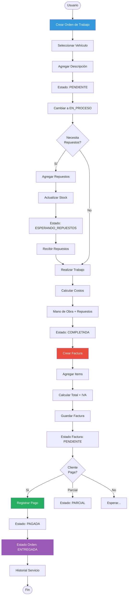

---

## TECNOLOGÍAS UTILIZADAS

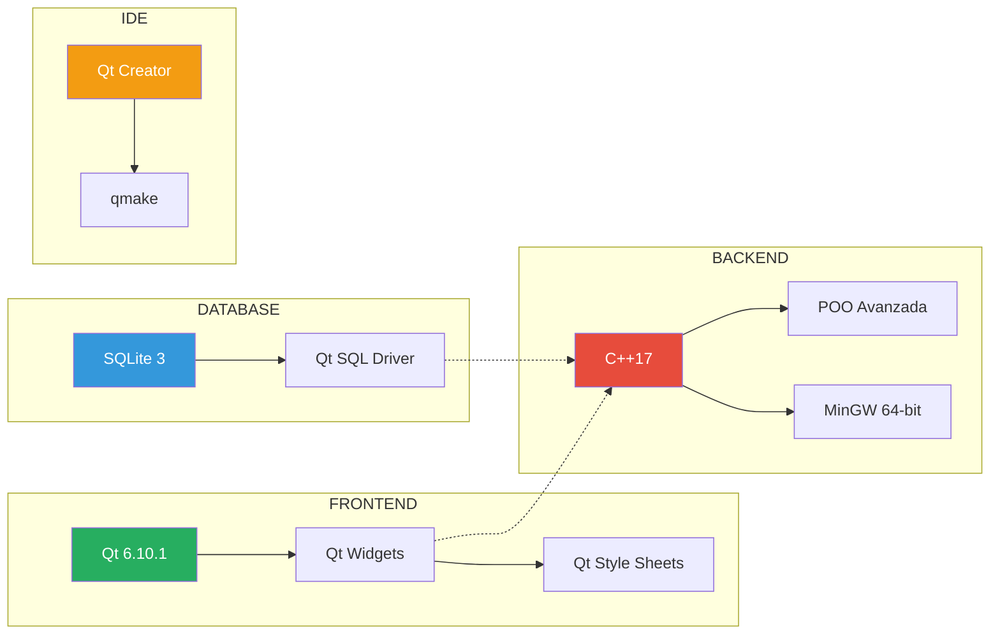

---

## 📸 GENERAR IMÁGENES PNG/SVG:

### ✅ MÉTODO RECOMENDADO: Mermaid Live
1. **Ir a:** https://mermaid.live/
2. **Copiar** el código Mermaid
3. **Pegar** en el editor
4. **Download PNG** o **Download SVG**

### ✅ VS Code con extensión
1. Instalar: **"Markdown Preview Mermaid Support"**
2. `Ctrl+Shift+V` para vista previa
3. Click derecho → **Copiar imagen**

---

**DIAGRAMAS PROFESIONALES LISTOS** ✅🎨

