# 🗄️ DIAGRAMA DE BASE DE DATOS (VISUAL)

## CÓMO VER COMO IMAGEN:
1. Ve a: https://mermaid.live/
2. Copia el código del diagrama
3. Se genera automáticamente como imagen bonita
4. Descarga como PNG o SVG

---

## DIAGRAMA ENTIDAD-RELACIÓN COMPLETO

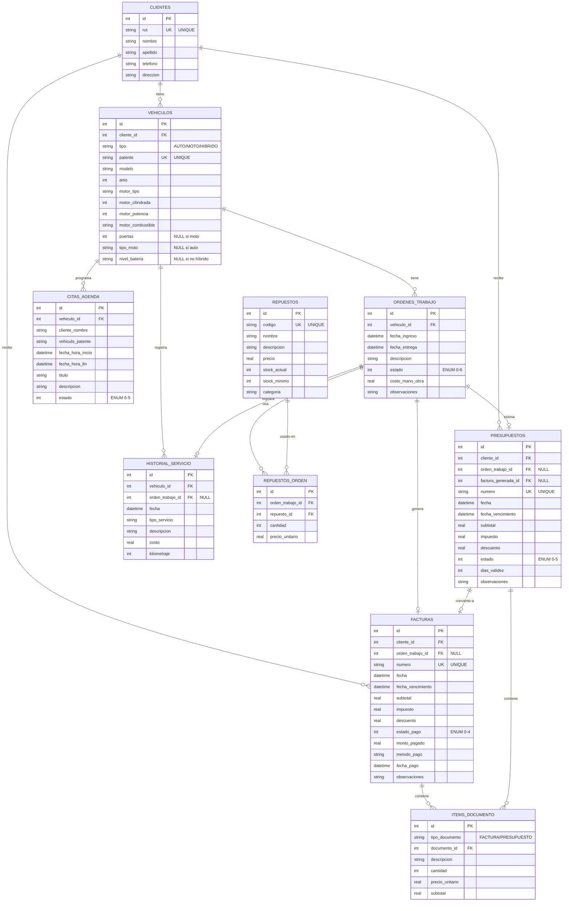

---

## RELACIONES DETALLADAS

### 1:N (Uno a Muchos)

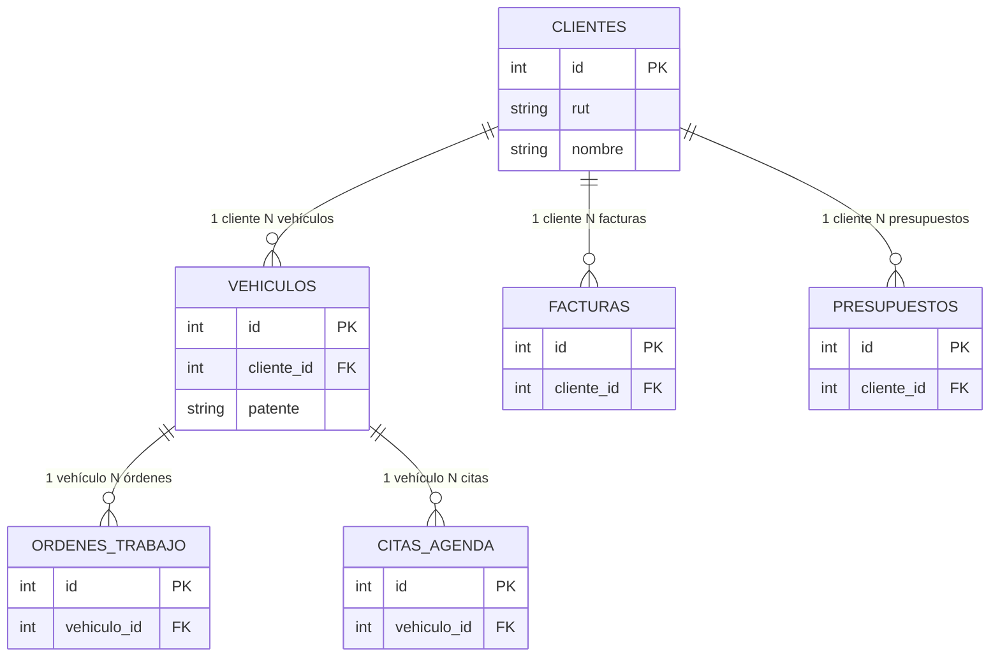

---

### N:M (Muchos a Muchos)

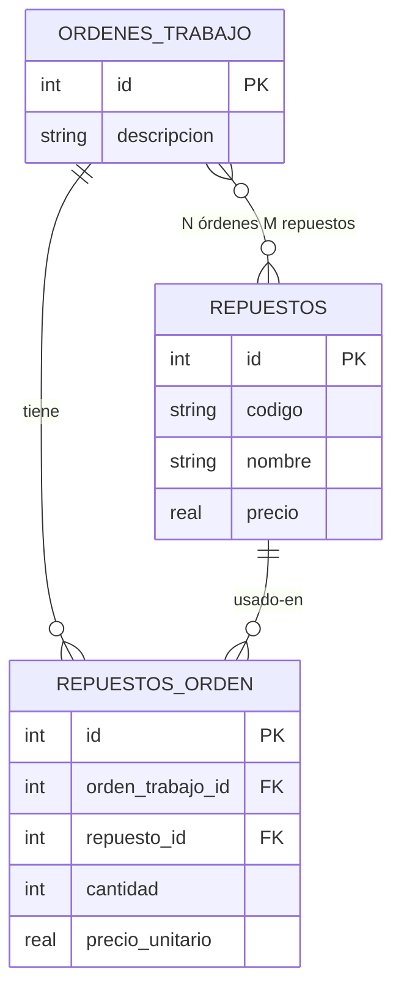

---

## DIAGRAMA POR MÓDULO

### MÓDULO: GESTIÓN DE CLIENTES Y VEHÍCULOS

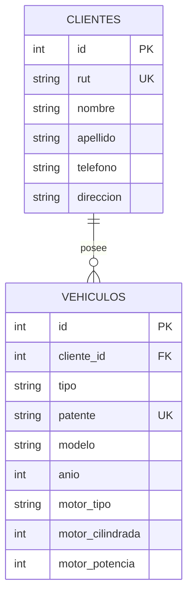

---

### MÓDULO: ÓRDENES DE TRABAJO

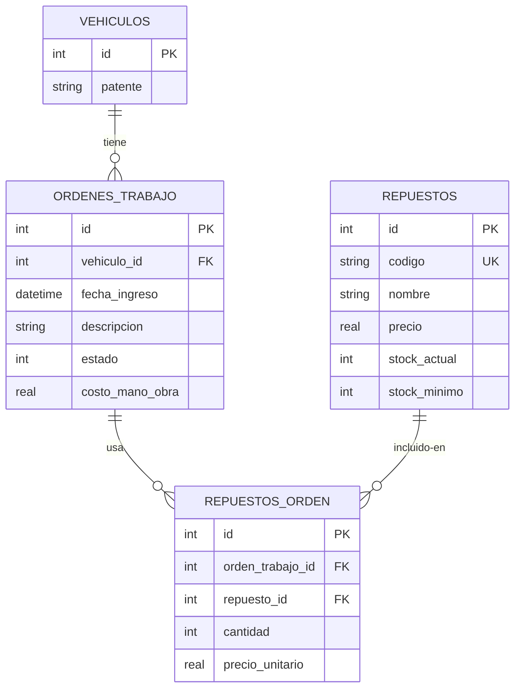

---

### MÓDULO: FACTURACIÓN

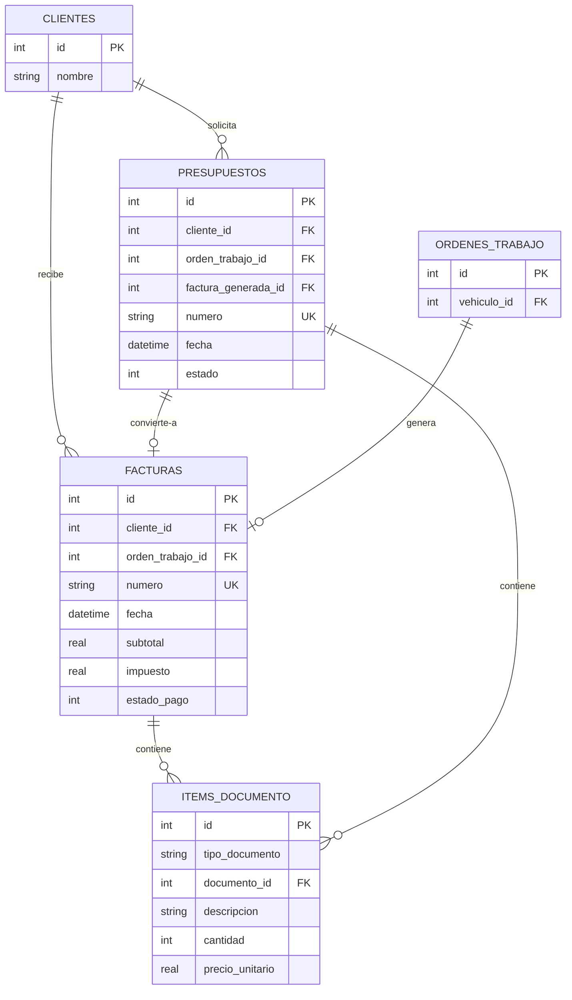

---

### MÓDULO: AGENDA

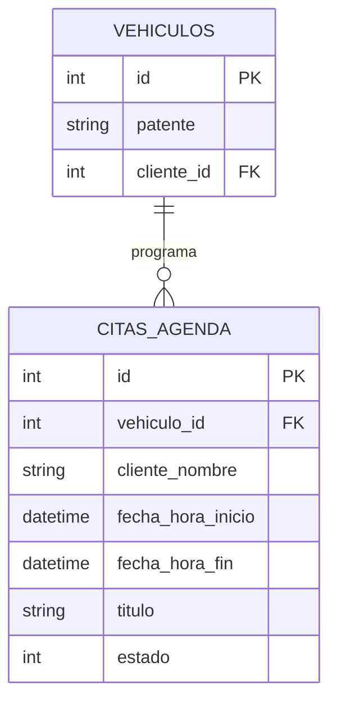

---

## ENUMS Y ESTADOS

### Estados de Órdenes

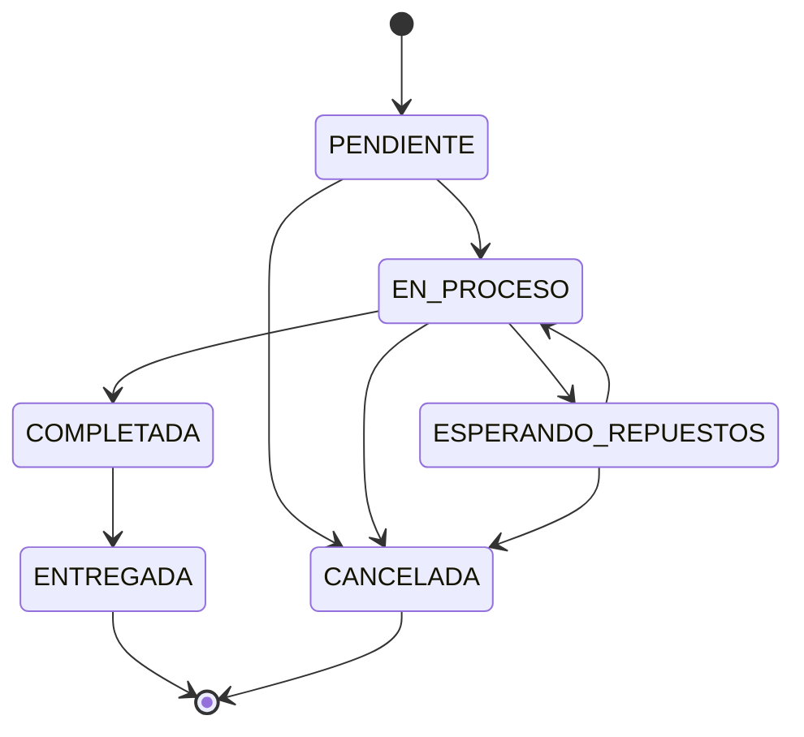

---

### Estados de Facturas

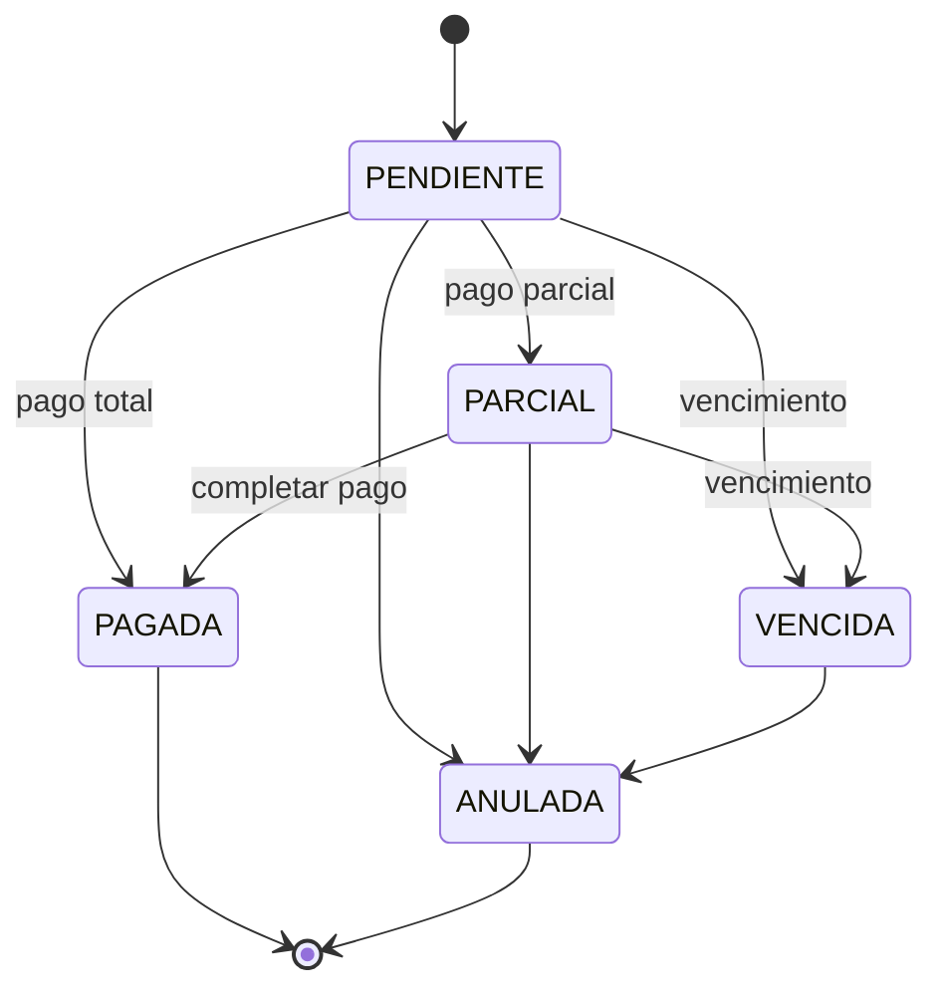

---

### Estados de Presupuestos

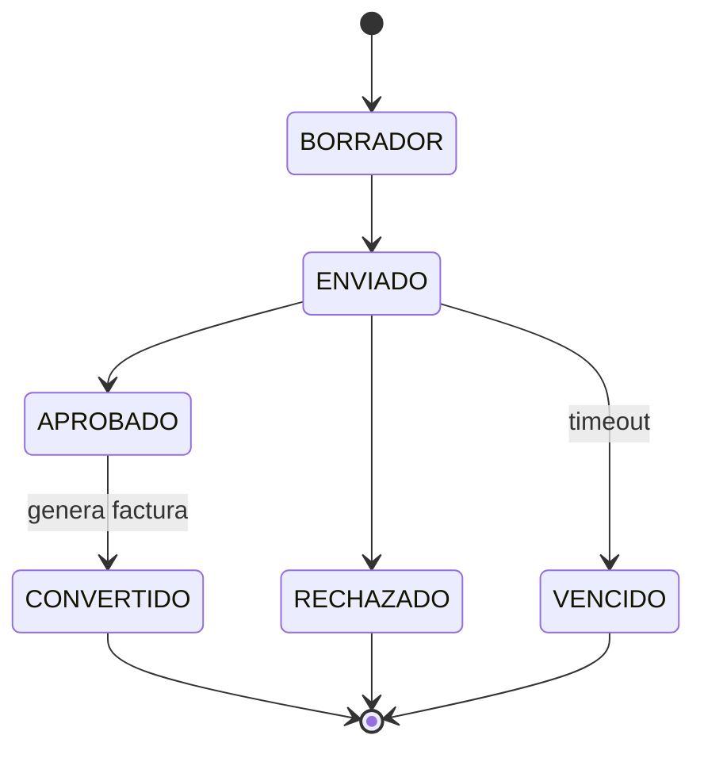

---

### Estados de Citas

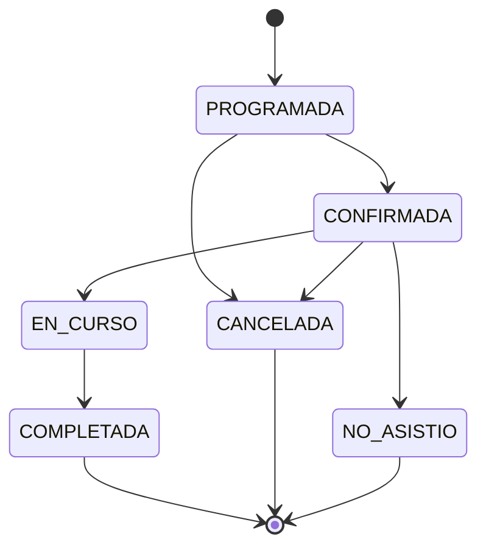

---

## ÍNDICES Y CONSTRAINTS

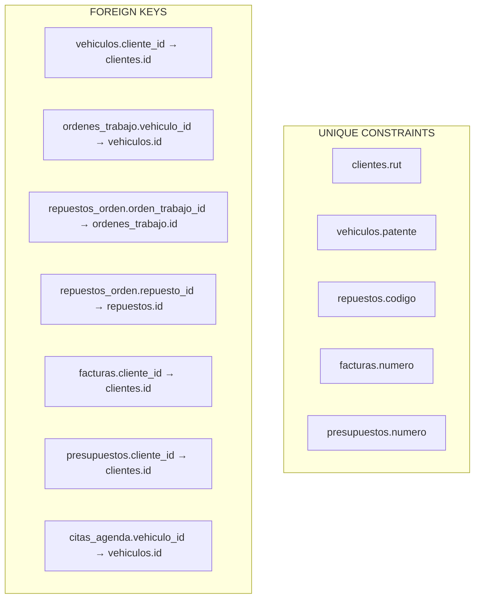

---

## ARQUITECTURA DE DATOS

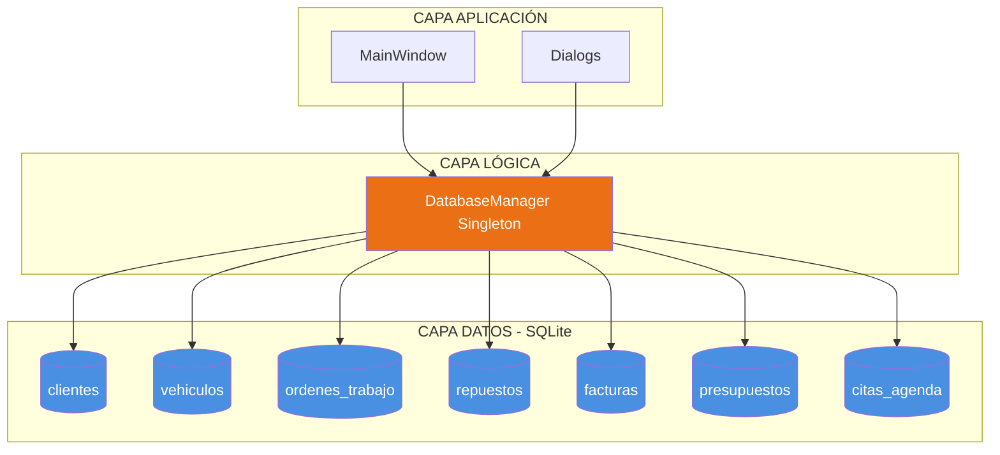

---

## 📸 CÓMO GENERAR IMÁGENES:

### ✅ Opción 1: Mermaid Live (MÁS FÁCIL)
1. **Ir a:** https://mermaid.live/
2. **Copiar** cualquier bloque de código Mermaid de arriba
3. **Pegar** en el editor
4. Se genera **automáticamente** el diagrama
5. Click **"Download PNG"** o **"Download SVG"**

### ✅ Opción 2: VS Code
1. Instalar extensión: **"Markdown Preview Mermaid Support"**
2. Abrir este archivo en VS Code
3. Presionar `Ctrl+Shift+V` para vista previa
4. Click derecho en el diagrama → **"Copy Image"**

### ✅ Opción 3: GitHub
- Subir este archivo a GitHub
- Se renderiza automáticamente

---

**TODOS LOS DIAGRAMAS SE VEN COMO IMÁGENES PROFESIONALES** ✅🎨

