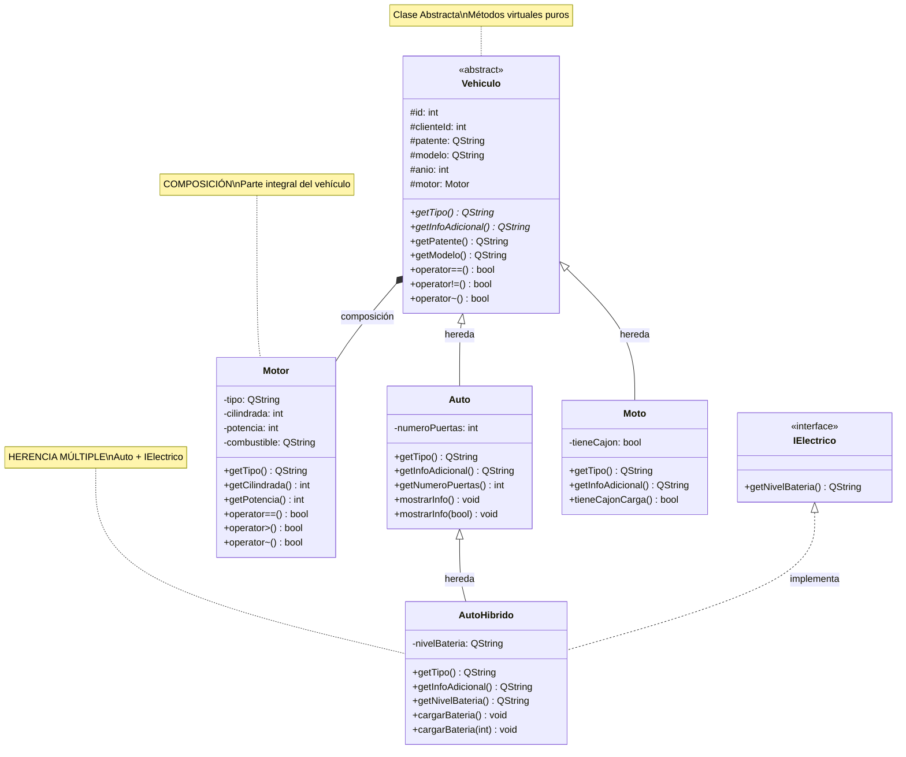
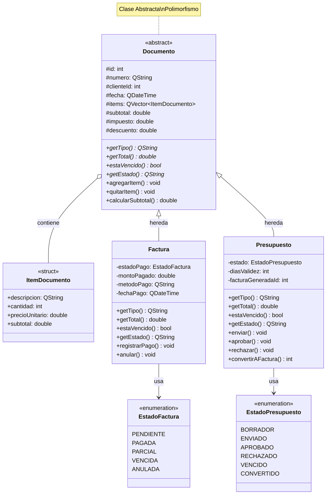
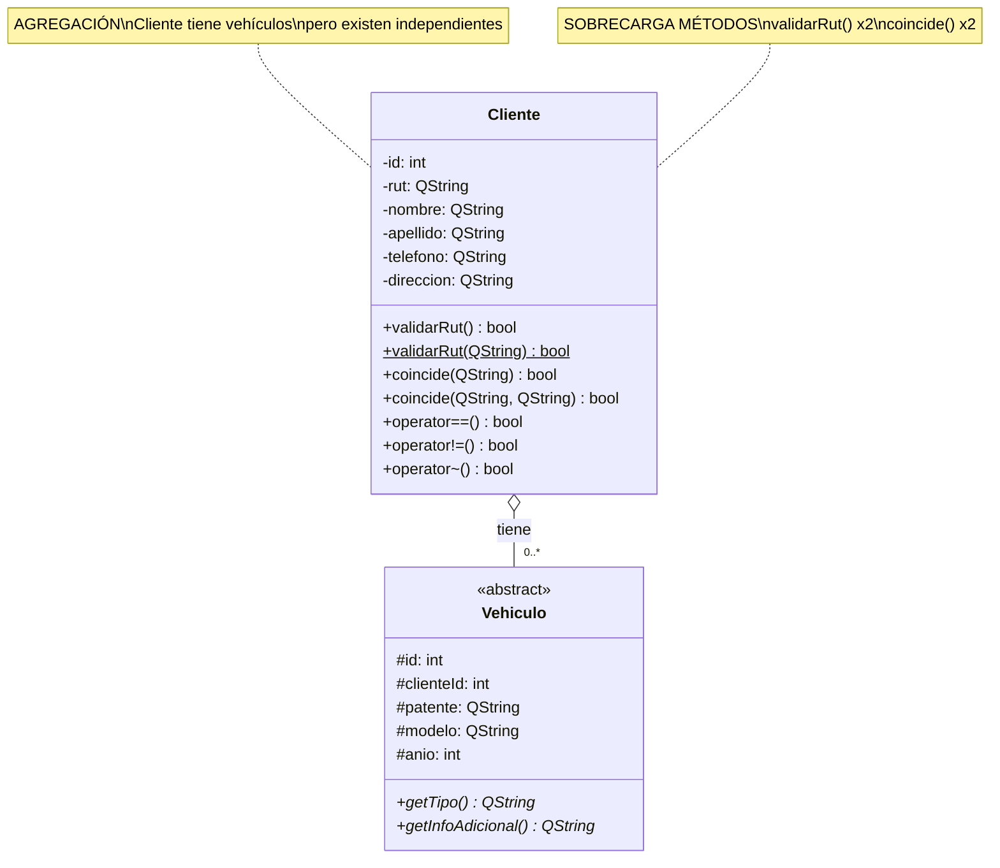
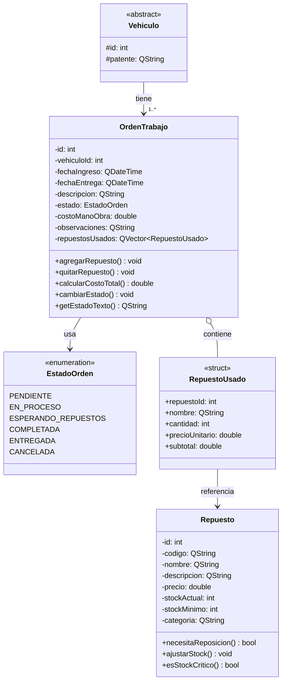
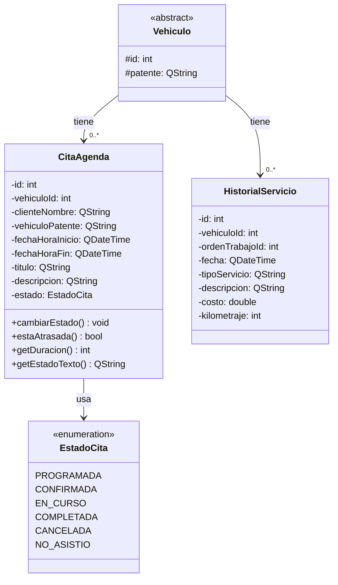
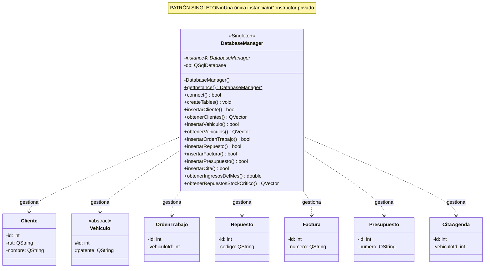
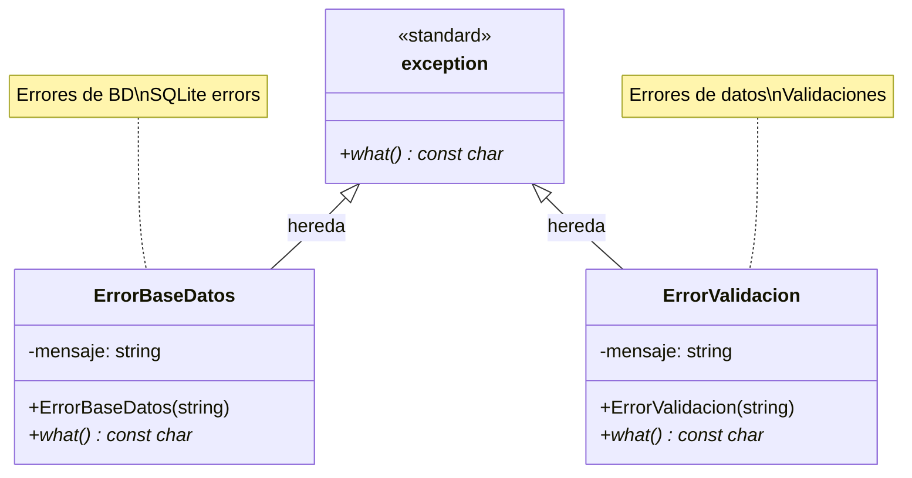
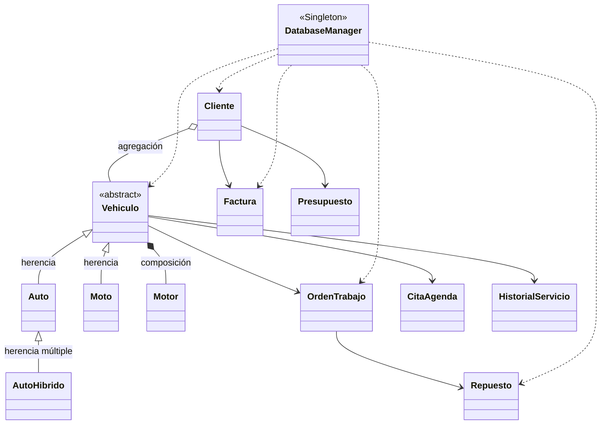

# 📊 DIAGRAMAS DE CLASES (VISUAL)

## CÓMO VER ESTOS DIAGRAMAS COMO IMÁGENES:

### Opción 1: GitHub
- Sube este archivo a GitHub y se verá automáticamente como diagrama

### Opción 2: VS Code
- Instala la extensión "Markdown Preview Mermaid Support"
- Abre este archivo y presiona `Ctrl+Shift+V` para vista previa

### Opción 3: Online (CONVERTIR A PNG/SVG)
1. Ve a: https://mermaid.live/
2. Copia el código del diagrama
3. Se genera automáticamente la imagen
4. Descarga como PNG o SVG

---

## 1. JERARQUÍA DE VEHÍCULOS (Herencia Simple y Múltiple)

---

## 2. DOCUMENTOS (Factura y Presupuesto)

---

## 3. CLIENTE Y VEHÍCULO (Agregación)

---

## 4. GESTIÓN DE ÓRDENES Y REPUESTOS

---

## 5. AGENDA Y CITAS

---

## 6. PATRÓN SINGLETON - DatabaseManager

---

## 7. EXCEPCIONES PERSONALIZADAS

---

## 8. DIAGRAMA GENERAL DEL SISTEMA

---

## LEYENDA DE RELACIONES

- `<|--` : **Herencia** (Auto hereda de Vehiculo)
- `*--` : **Composición** (Motor es parte de Vehiculo)
- `o--` : **Agregación** (Cliente tiene Vehículos)
- `-->` : **Asociación** (Relación simple)
- `..>` : **Dependencia** (Usa temporalmente)
- `<|..` : **Implementación** (Implementa interfaz)

---

## CÓMO GENERAR IMÁGENES PNG/SVG:

### Método 1: Mermaid Live Editor
1. Ve a: https://mermaid.live/
2. Copia cualquier bloque de código Mermaid
3. Se genera automáticamente
4. Click en "Download PNG" o "Download SVG"

### Método 2: VS Code
1. Instala extensión: "Markdown Preview Mermaid Support"
2. Abre este archivo
3. Click derecho → "Markdown Preview Mermaid: Save to PNG/SVG"

### Método 3: Online Converter
- https://mermaid.ink/ (convierte código a URL de imagen)

---

**TODOS LOS DIAGRAMAS SON RENDERIZABLES COMO IMÁGENES** ✅

